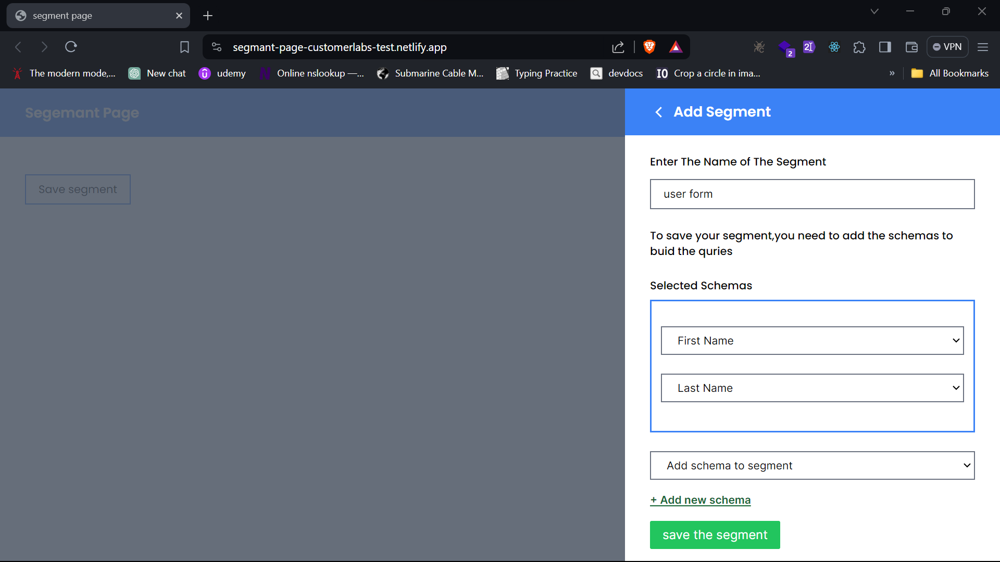

# Segmant page customer labs react test

Level 1 - Frontend Developer Skill Assessment from Customerlabs.Inc

# Assessment

demo design:


## Assessment Instruction

> Create a simple react application using the screen-1.0

1. Create a page with a button caption “Save segment”

2. When a user click on “Save segment” button a popup should appear

3. The popup should contain a text box to get the segment name

4. And also it should have dropdown name as “Add schema to segment” with
   below options

   - **Label**: First Name **Value**: first_name
   - **Label**: Last Name **Value**: last_name
   - **Label**: Gender **Value**: gender
   - **Label**: Age **Value**: age
   - **Label**: Account Name **Value**: account_name
   - **Label**: City **Value**: city
   - **Label**: State **Value**: state

5. Add a link and name as “+Add new schema”

6. When a user select an option from the “Add schema to segment” dropdown and
   click on “+Add new schema” a new dropdown should added to the Blue box

7. The newly added dropdown should be able to change. And it should have
   options which are not selected yet.

8. Once the new dropdown added to the blue box “Add schema to segment” should
   be reset and have unselected options

9. When user click on “save the segment” send data to server in below format

```js
{
"segment_name": "last_10_days_blog_visits",
"schema": [
{"first_name": "First name"},
{"last_name": "Last name"}
]
}
```

10. To send data to server users https://webhook.site/ website. From this
    website you will get a webhook URL, use that to send data.

# My solution

I have created a segment page application with the above Instruction

### Tools and Technolgy used

- React js
- TailwindCss
- vite Bundler
- webhooksite URL
- Netlify hosting

### Features

- modal popup
- dynamic select option
- simple alert validation
- responsive design

### Live Link

you can see the live site [here](https://segmant-page-customerlabs-test.netlify.app/).

### Screenshots

- home page :

  

- popup open :

  

- Add Data to the segment Form:

  

- Add Schema to segment select box only have an unselected scheama option :

  

- Selected Scheama also changble with remain options

  

- The segment saved

  

- Posted Data with webhooksite url

  
  you can see the posted data with this [link](https://webhook.site/#!/view/0ef44baf-96aa-42e0-a404-a50328fec69a/dc3c8584-f170-4d75-9526-2c3c7c0a29e7/1)

## To run this project locally

clone this repositery and run below commands.

> npm install

> npm run dev

## Contact Me

- Connect with me on LinkedIn: [Vijayavedhasekaran K](www.linkedin.com/in/vijayavedhasekaran002)
- Follow me on Instagram: [@vedha_since_2002](https://www.instagram.com/vedha_since_2002/)
- Email: [vedhatech02@gmail.com](mailto:vedhatech02@gmail.com)
